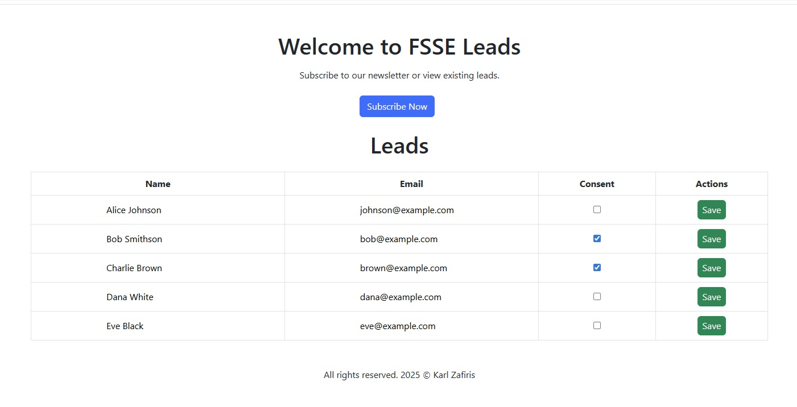
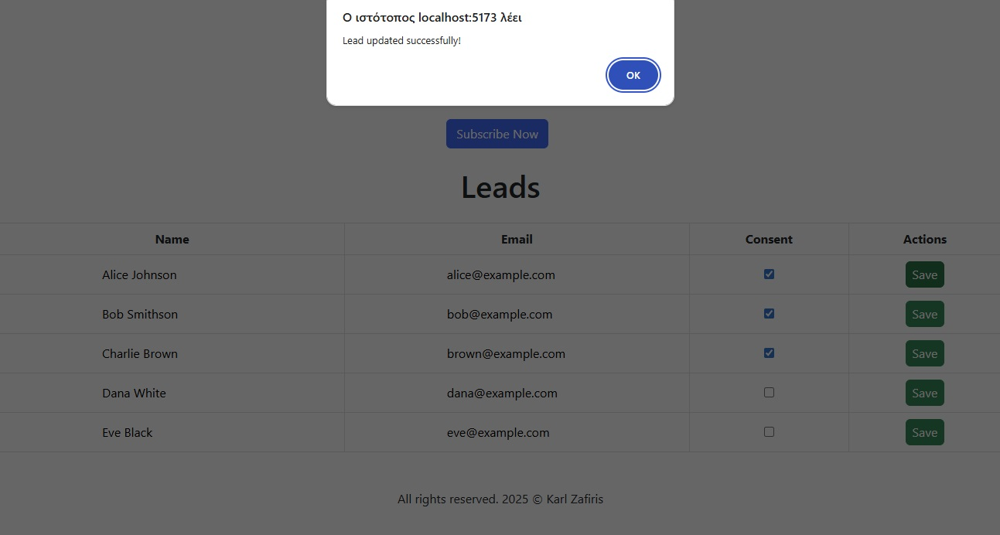
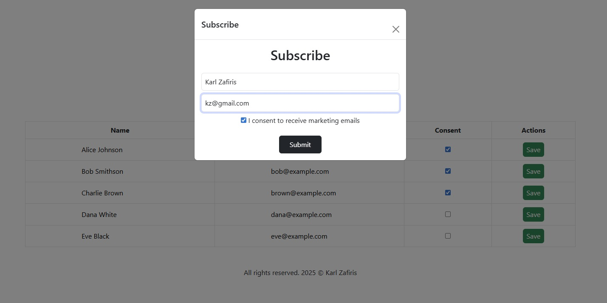
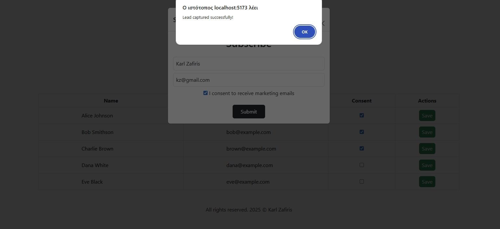
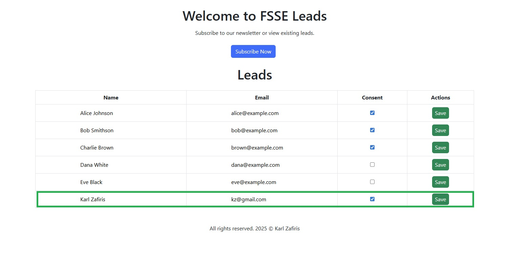
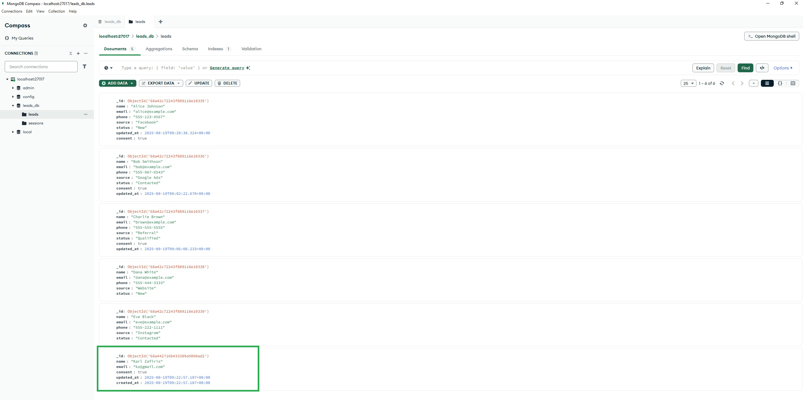

# FSSE Leads

A simple POC of a lead capturing application built with **Laravel**, **MongoDB**, and **Vue.js**.  
This project allows you to add, update, and view leads, with optional Mailchimp integration.
Author: Karl Zafiris
---

## Features

- Add new leads with name, email, and consent status
- View and edit leads in a table
- Update leads in real-time via API
- Optional integration with Mailchimp to sync subscribers
- CORS ready for frontend-backend separation

---

## Tech Stack

- **Backend:** PHP, Laravel 12, MongoDB
- **Frontend:** Vue 3, Axios, Bootstrap 5
- **API:** RESTful endpoints

---

## Installation
`git clone https://github.com/karlzafiris/fsse_leads.git`
`cd fsse_leads`

## Install backend dependencies
`cd backend`
`composer install`

## Copy the example environment file
`cp .env.example .env`

## Generate the application key
`php artisan key:generate`

## Install frontend dependencies
`cd frontend`
`npm install`

## Build frontend assets for development
Inside fronted folder run:
`npm run dev`

## Start the Laravel backend server
Inside backend folder run:
`php artisan serve`

## Screenshots

